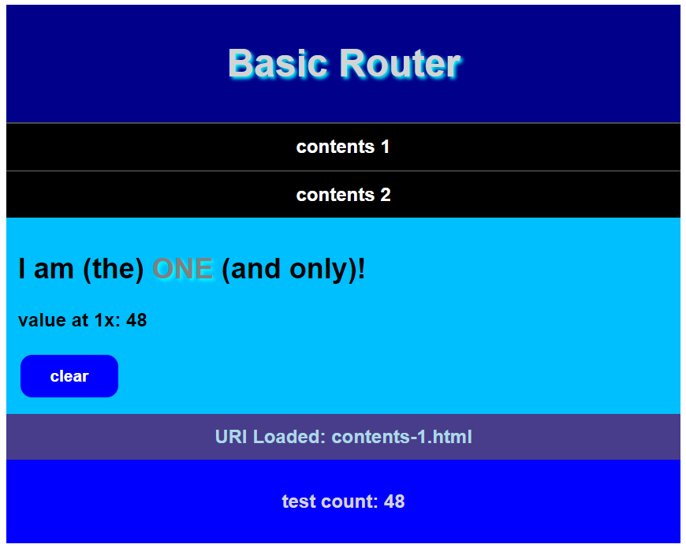

# Load HTML in a *div*: basic SPA

This example showcases a basic Single Page Application, reloading HTML pages in a `div` section dynamically with AJAX

It demonstrates script is not affected by the operation and that loaded HTML becomes part of the page and can interacts with variables and functions living in script

Makes use of ECMAScript 6 in the scripts (using promises, etc)

This example is scaffolded with some CSS involving responsive flexbox

